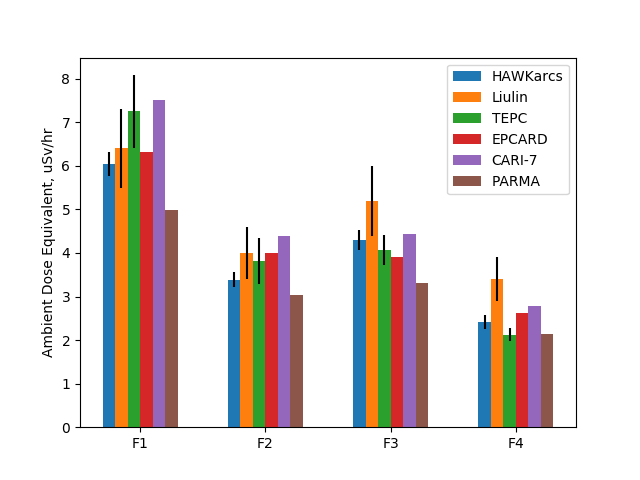
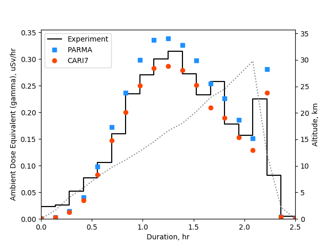

# Aviation dosimetry validation

## Introduction

Everyday cosmic radiation enters the Earth's atmosphere, significant amount of this radiation is made up of gamma rays. 

This validation study will be does two comparisons, using PARMA and CARI-7 APIs. The first compares the APIs with data gathered from a collaborative European study, and the seond with a University of Sydney study. 

This study will validate the API's ability to model gamma radiation in Earth's atmosphere.

## Aim

To validate the Amentum Ray APIs by comparing experimental data obtained during plane flights (European study) and the ascent of a balloon (the USyd study) against model prediction.

## Run the analysis

Run the analysis scripts by entering the following in a terminal

        python experiment.py
    or
        python flight.py

Experiment.py shows the comparison between the University of Sydney study and the APIs, and flight.py shows the comparison between the European study and the APIs

## Results

We can see that European study and the API results are close to the experimental data, the CARI-7 model is even within the experimental error for almost every measurement.
The results from the USyd study do not agree with the data gained from the API models.

***
The bars are broken into groups of when the readings were taken. G1: Altitude = 40,000 ft; Latitude = 57 N; Longitude 8 E
G2: Altitude = 32,000 ft; Latitude = 57 N; Longitude 8 E
G3: Altitude = 40,000 ft; Latitude = 42 N; Longitude 12 E
G4: Altitude = 32,000 ft; Latitude = 42 N; Longitude 12 E
***

## Acknowledgement

Thanks to DR Iwan Cornelius, Amentum Aerospace CEO, his insight and guidance was invaluable throughout this validation.

Lillhök, j. et al. 2007 "A comparison of ambient dose equivalent meters and dose calculations at constant flight conditions", Radiation Measurements, vol. 42, pp. 323-333

Mukherjee, B., et al. 2016 "Near space radiation dosimetry in Australian outback using a balloon borne energy compensated PIN diode detector", Radiation Measurements, vol. 94, pp. 65-72 